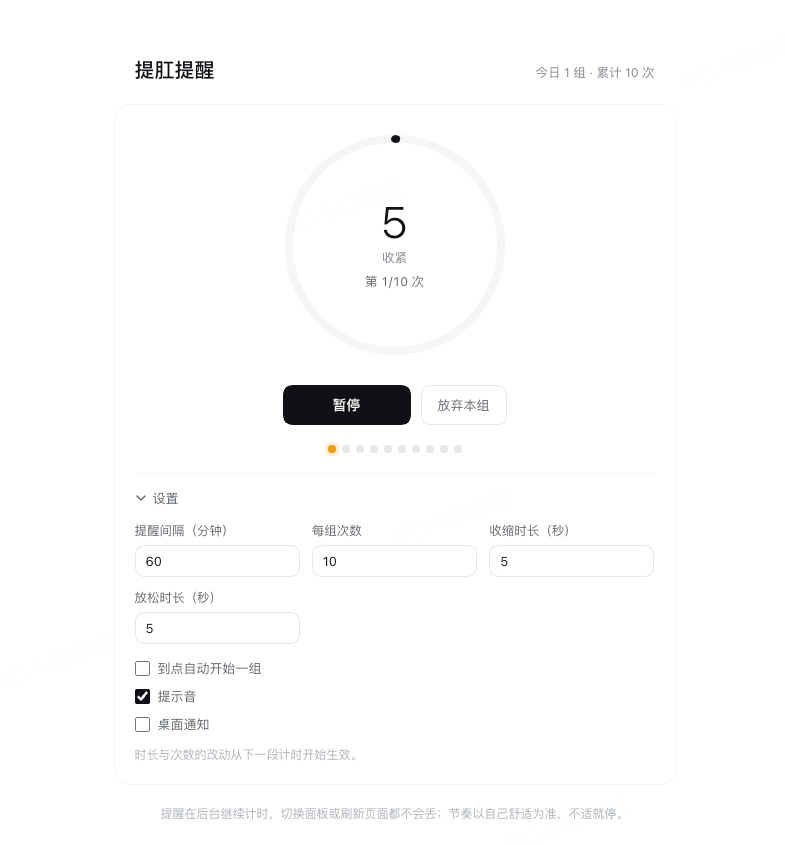

# dsh-plugin-kegel

English | [中文](README.zh.md)

[](https://github.com/jueshali/dsh-plugin-kegel/actions/workflows/ci.yml)

A **Kegel (pelvic-floor) reminder** for [DeepSeek Harness](https://github.com/deepseek-ai/deepseek-harness) — an
interval timer that nudges you once an hour and then guides a set of squeeze/release reps with audio cues.

It is a reminder, **not medical advice** and not a training log. Go at a comfortable pace and stop if anything hurts.

```
┌ sidebar ────────────┐   ┌ panel ────────────────────────────────────┐
│  ⏱ Kegel reminder    │ → │  Next reminder in 42:15   ◔ progress ring │
│  ⚙ Plugins           │   │  [Do a set now] [Restart timer]           │
└─────────────────────┘   │  3 sets today · 30 reps   /  settings     │
                          └───────────────────────────────────────────┘

┌ conversation header ──────────────────────────────────────────────┐
│ (◔ 42:15 ·) ▶ ↗     Session title …                               │
└───────────────────────────────────────────────────────────────────┘
       │       │ └ open the full panel
       │       └ do a set now (hidden while a set is running)
       └ click = the current phase's main action
         (waiting → start · squeezing → pause/resume)
```



*The full panel mid-set (Chinese UI — the plugin ships both `zh` and `en` dictionaries).*

The chip sits in the window-drag band of the conversation header, so it carries its own
`-webkit-app-region: no-drag`, written as `.kg_chip.kg_chip` to outrank the host's
`[data-window-drag]` rule regardless of stylesheet order — otherwise a click would drag the window.

## Install

Requires a DSH build with the **web surface** (`@deepseek-ai/dsh-base` + `@deepseek-ai/dsh-web-app`
profile bundles). Developed and verified against **0.2.0-rc.2**.

```bash
# From GitHub, through the plugin manager (installs the bundle and selects it):
plugin_manager install_bundle github:jueshali/dsh-plugin-kegel
```

You can also paste `github:jueshali/dsh-plugin-kegel` into the **Plugins** page in the sidebar, or, after an
npm release, `plugin_manager install_bundle dsh-plugin-kegel`.

The plugin is a *bundle*: installing it adds `dsh-plugin-kegel` to `dsh.profile.bundles`, and its
[`cordis.patch.yml`](cordis.patch.yml) inserts the one loader row the plugin needs. To uninstall:

```bash
plugin_manager remove_bundle dsh-plugin-kegel
```

<details>
<summary>Manual install (no package manager)</summary>

Clone the repository anywhere, then make the package resolvable from your profile and add it to the
profile's bundle list:

```jsonc
// <profile>/package.json
{
  "dependencies": { "dsh-plugin-kegel": "link:/absolute/path/to/dsh-plugin-kegel" },
  "dsh": { "profile": { "bundles": ["@deepseek-ai/dsh-base", "@deepseek-ai/dsh-web-app", "dsh-plugin-kegel"] } }
}
```

No build step is needed — the browser half is committed as `lib/client.js`.
</details>

## How it works

```
       interval elapses        "Start set"
wait ──────────────────► due ─────────────► squeeze #1 ─► release #1 ─► … ─► squeeze #N
  ▲                      │                                                      │
  │                      │ snooze 5 min                                         │ set done
  │                      └──────────────────────────► wait ◄────────────────────┘
  └───────────────────────────────────────────────────┘
```

- **wait** — a countdown to the next reminder; it starts ticking as soon as the plugin mounts.
- **due** — time is up: an audio cue plus an optional desktop notification. It waits for you to start or
  snooze; it does **not** auto-run the guided set by default, so a reminder that fires while you are away
  cannot silently "complete" itself and reset your clock. Turn on *Start a set automatically when due* if
  you want full automation.
- **squeeze / release** — the guided set, with a different cue per transition (rising two-tone for squeeze,
  a low tone for release, a three-note flourish when the set completes).
- A set that finishes credits itself, notifies you with the next reminder time, and immediately starts the
  next interval.
- If the interval elapsed while the page was closed you get **one** reminder when you come back, not a backlog.
- Countdowns are deadline-based (`endAt` timestamps), so a throttled background tab cannot make them drift;
  the state is mirrored into `localStorage` (`dsh.kegel.v1`) so a refresh never loses it.

## Settings

| Setting | Default | Range |
|---|---|---|
| Reminder interval (min) | 60 | 1–480 |
| Reps per set | 10 | 1–50 |
| Squeeze (seconds) | 5 | 1–60 |
| Release (seconds) | 5 | 1–60 |
| Start a set automatically when due | off | on/off |
| Audio cues | on | on/off |
| Desktop notification | off | on/off |

Today's set/reps counters reset with the calendar day.

## Slots it occupies

| Slot | Kind | Content |
|---|---|---|
| `main` | keyed, key `kegel` | the full panel |
| `sidebar.panellist` | list, id `kegel` | the sidebar icon; the id matches the `main` key, so the icon opens that panel |
| `conversation.header.leading` | single, root | the header chip described above |

## Development

```
lib/index.js       node half  — an empty apply(); its only job is to exist as a loader row
lib/client.js      browser half — the whole UI, hand-written as a lazy-CJS bundle
cordis.patch.yml   the bundle patch that inserts the loader row
test/smoke.mjs     offline test: no browser, no DSH, ~60 assertions
```

```bash
node test/smoke.mjs     # syntax + contract + state machine + rendering, all stubbed
```

`test/smoke.mjs` reproduces the two contracts the shell enforces — the bundle shape
(`window.__ModuleLoader__.load({ id, factory })`, side effects deferred to materialization) and the plugin
body (`apply(ctx)` + `inject`) — then drives the reminder engine on a controlled clock and renders every
component with a stub React. CI runs it on Node 18/20/22.

### Two things worth knowing before you edit this

1. **The browser half is the package's client half.** `@deepseek-ai/dsh-client-modules` scans enabled loader
   entries for packages declaring `dsh.client.platform === "web"`, resolves `exports["./client"]`, and serves
   it from `/plugins/<package name>/client.js`. The bundle's `id` must equal the package name. It only
   `require`s `react`, which the shell seeds, so the package has no runtime dependencies and no build step —
   edit `lib/client.js` directly.
2. **Editing `lib/client.js` is not enough on its own.** The node half snapshots the bundle bytes at
   *compose* time, so a page refresh still serves the old code. To pick up a change, make the loader
   re-process the row — toggle the plugin off and on
   (`plugin_manager set_plugin include:ui-kegel enabled=false`, then `enabled=true`), or restart DSH. The
   client HMR chain then pushes the new module to the browser, usually without a manual refresh.

## License

[MIT](LICENSE)
